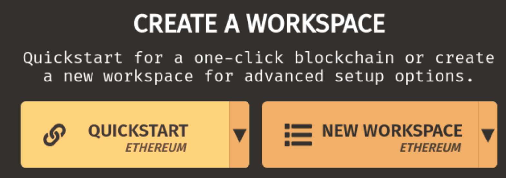
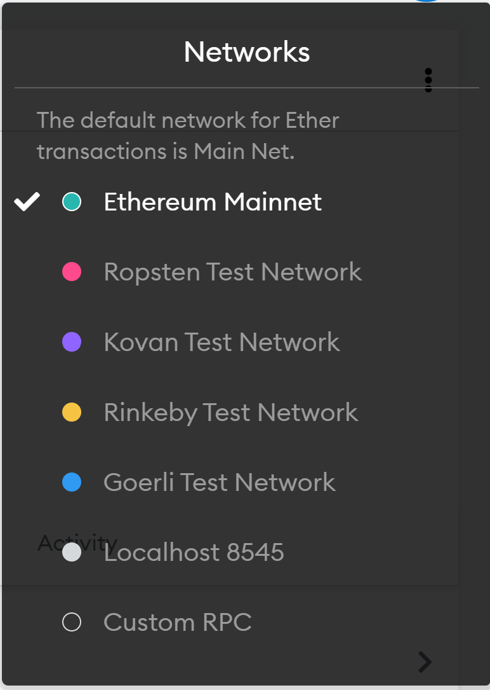
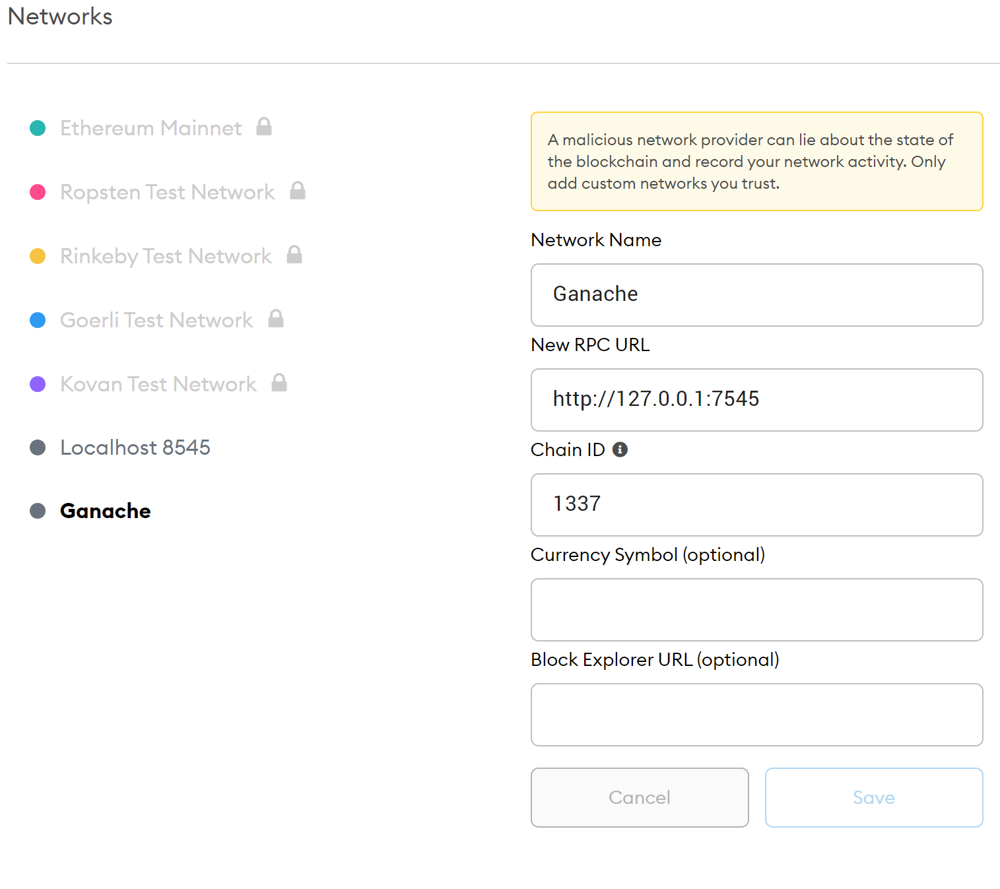
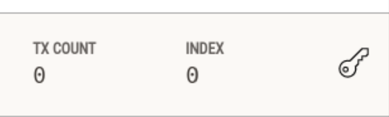
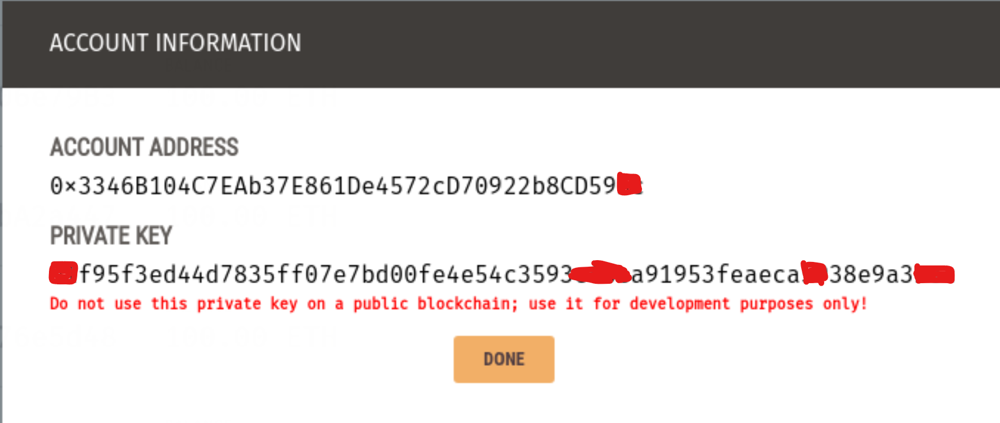
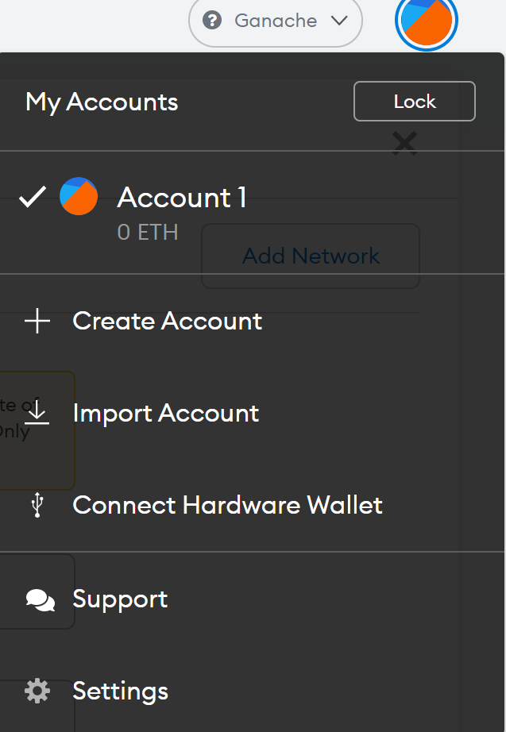
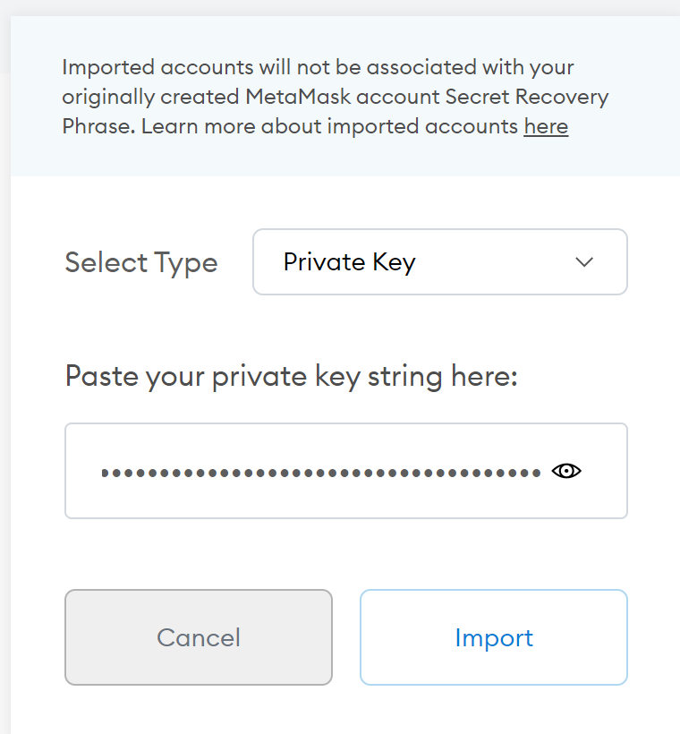
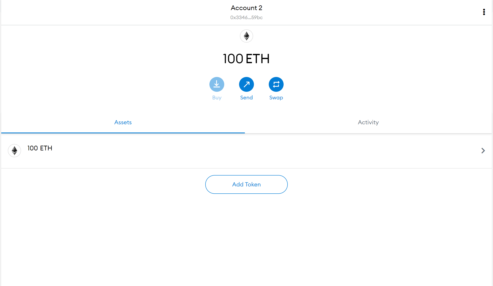
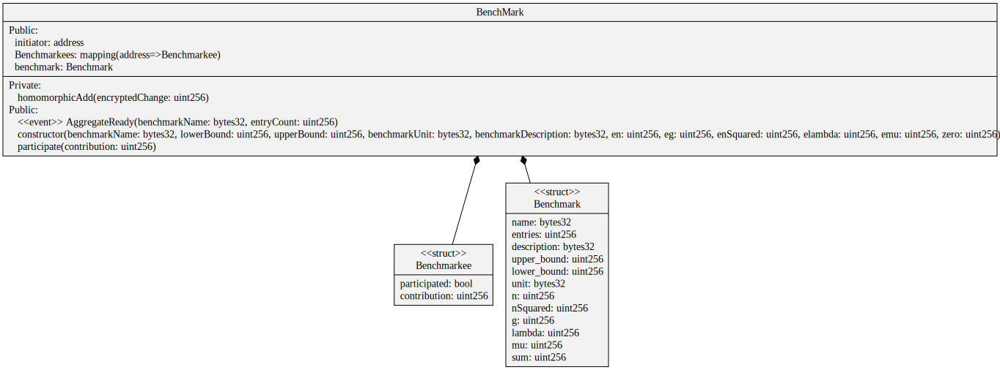

# Simple Benchmarking Contract
Illustrates a pretty basic benchmarking contract.

The contract uses an upper and lower bound to validate the entry. Additionally the deploying party may choose an unit (i.e. Mio. €).
The benchmarkees are deduplicated (one entry per benchmarkee).
The benchmarkees are only pseudonymized by their address. Their entry is clearly visible via any Blockchain explorer.
The sum is queriable after the 3rd entry at the moment.

Math is done via fixed point math with 19 - precision

The Typescript "Client" is intended for Node.JS usage and proofs at the moment, that connectivity is possible and that the average with multiple account via smart contract matches the locally calculated average.

## Math with Ethereum
Suppose we have two numbers,
3.141592653589793238462643383279502884197169399375105820974944
and 1.123456789012345678901234567890.
As Ethereum's floating point math support is not quite usable yet, I diverted to using fixed point math by using https://github.com/hifi-finance/prb-math's excellent library.
The library "reserves" 19 digits of an integer to save the "after-comma part" (see the table below)

| "pre-comma" part | "after-comma" part  (19 digits, everything gets truncated to 19) |
|------------------|------------------------------------------------------------------|
| 3                | 1415926535897932384                                              |
| 1                | 1234567890123456789                                              |

Pi for example would be transmitted as 31415926535897932384, the number 2 as 20000000000000000000. 
This is expected and required to perform mathematical operations.

## Using/Hosting the app (developer mode)

### Dependencies:
Blockchain/Ethereum:
- Ganache (Emulates an Ethereum Blockchain and provides 10 Accounts for usage) https://www.trufflesuite.com/ganache
- Metamask Browser extension (provides underlying primitives for connecting to Ethereum/Ganache either via Infura or locally) https://chrome.google.com/webstore/detail/metamask/nkbihfbeogaeaoehlefnkodbefgpgknn?hl=de

Webclient:
- either Chrome or any Chromium related browser (i.e. Chromium Edge) [it might work on Firefox as well, although not tested]
- Node.js > v12

### Procedures:
#### Compiling the contract (in case something has changed)
Run `npm install` and then `npx truffle compile` in the `contract` directory.
In case you are running windows copy the contracts like this: `cp -r build/contracts ../client/src`
For running on bash compatible OS'es (i.E. Mac or Linux-derivatives) use the `./compile-contracts.sh` script in the `contracts` folder

### Start Ganache 

Use the `Quickstart Ethereum` option (this should suffice for development purposes)

### Setup Metamask

| Attribut     | Wert                  |
|--------------|-----------------------|
| Network Name | Ganache               |
| New RPC URL  | http://127.0.0.1:7545 |
| Chain ID     | 1337                  |

### Key import from Ganache

### Start Web Frontend
Run `npm run start`

## UML 
